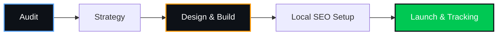

  

---

> **Quick answer:** A local retail shop in Bihar Sharif must digitize its inventory to survive. That means giving local customers the ability to browse your catalog online, order via WhatsApp, and pay via UPI before they ever step foot in the store. A generic brochure website won't help — you need a mobile-first e-commerce catalog optimized for local SEO, fast loading, and direct orders.

## 📉 Why Traditional Retail is Under Pressure in 2026

A customer searching for **"best clothing store near me"** or **"kirana store in Bihar Sharif"** expects to see what you sell on their phone, usually in the evening. They don't have the patience to walk into three different shops to check availability. 

The shop with a clear, fast, and searchable digital catalog wins the order. Traditional foot traffic is dropping as big aggregators step in, taking high commissions and eating local margins.

> **This is a revenue problem, not a technology problem. One lost customer to an aggregator costs you repeat business for years.**

## 📦 What Does "Digitizing Inventory" Actually Mean?

Digitizing inventory means moving your physical stock list to a live online catalog. For a local shop owner, this doesn't mean building Amazon. It means:

- Giving local customers a link to see what is currently in stock.
- Letting them add items to a cart.
- Sending that cart directly to your WhatsApp for fulfillment.
- Creating a system where a customer never has to call and ask, "Bhaiya, yeh item hai kya?"

## 🏗️ The 7 Components of a Local Retail E-Commerce Website

### 1. Online Catalog with Inventory Sync

Every category should lead the customer toward **one action: adding to cart**. Your catalog needs clear images, exact pricing, and stock status.

### 2. WhatsApp Ordering Integration

Local commerce runs on trust. Instead of complex checkout flows, a "Send Order via WhatsApp" button immediately connects the buyer to the shop owner, allowing for personalized service and easy modifications.

### 3. Local SEO and Google Business Profile Setup

Local SEO decides whether your shop appears when locals search nearby. It covers:

| Element | What It Means |
|:--|:--|
| **Google Business Profile** | Correct category (Clothing/Grocery), accurate hours, store photos |
| **Local Keywords** | "e-commerce website developer in Bihar Sharif", "buy clothes online Bihar Sharif" |
| **NAP Consistency** | Identical Name, Address, Phone on website, GBP, and directories |

### 4. Mobile-First Design

Most customers in Bihar browse on phones. Design for the phone first, then scale up. Buttons must be tappable, images must load instantly, and the cart must be accessible with one thumb.

### 5. Payment Options (UPI, COD, Online)

Do not force customers into complex payment gateways. Give them what they already use: Cash on Delivery and direct UPI scanning for local drops.

### 6. Delivery or Pickup Flow

Offer flexible fulfillment: "Pick up at store in 1 hour" or "Same-day delivery in Bihar Sharif." This is an advantage aggregators cannot beat.

### 7. Analytics and Repeat-Customer Tracking

Install analytics. You should know:

- How many people browsed your catalog today
- Which items are viewed the most but not bought
- How many inquiries came from Google vs. WhatsApp shares

---

## ⚖️ Traditional Walk-In vs. Digital-First Retail

| Factor | Traditional Shop | Digital-First Shop |
|:--|:--|:--|
| **Reach** | Only the street you are on | Entire Bihar Sharif & Nalanda |
| **Cost of Acquisition** | High (rent, displays) | Low (Local SEO, shares) |
| **Repeat Customers** | Depends on memory | Driven by WhatsApp links |
| **Margin Retention** | Good, but shrinking volume | High (no aggregator fees) |

---

## 🔍 What Local Customers in Biharsharif Actually Search

Developers search **"e-commerce website developer in Bihar Sharif"**. Customers search differently:

| Customer Search | Intent |
|:--|:--|
| best clothing store near me | Discovery |
| online grocery delivery Bihar Sharif | Ready to act |
| buy [product name] in Biharsharif | Specific intent |
| बिहारशरीफ किराना ऑनलाइन | Hindi search |
| wholesale shop near me | B2B comparison |

Build categories around these phrases. Verify them with **Google Search Console**.

---

## 💸 The Cost of Doing Nothing

Let's do the math with realistic Tier-2 retail numbers, not round guesses.

| Input | Value | Why this number |
|:--|:--|:--|
| Average order value | ₹800 | Typical basket size for local kirana or clothing delivery. |
| Aggregator orders | 150 / month | Estimated volume a small shop might fulfill via third-party apps. |
| Aggregator commission | 25% | Common mid-point (20%–30%) for retail aggregators in India. |
| Direct channel cost | 0% | Assuming direct UPI scan or Cash on Delivery via WhatsApp. |
| Repeat customer rate | 40% | Average rate for local essentials, harder to retain on aggregator apps. |

| Line | Calculation | Result |
|:--|:--|:--|
| Aggregator margin per order | ₹800 - (₹800 × 25%) | ₹600 kept |
| Direct margin per order | ₹800 - ₹0 fees | ₹800 kept |
| Difference per order | ₹800 - ₹600 | **₹200 loss per order** |
| Monthly difference | 150 orders × ₹200 | **₹30,000 lost monthly** |
| Annual difference | ₹30,000 × 12 months | **₹3,60,000 lost annually** |
| Recovery time for website | ₹30,000 ÷ setup cost | Usually recovered in **1 to 2 months** |

> **Note:** These figures are directional estimates based on publicly available market patterns for Tier-2 Indian retail and common aggregator commission structures. Actual numbers vary by store, city, category, and season. The purpose of the table is to show the shape of the loss, not to promise a specific outcome. Owners should replace every input with their own real numbers before drawing conclusions.

> **Do the math yourself:** Fill in this same table with your own monthly order volume and average basket size to see your real revenue leak.

---

## ⏳ Why Early Action Matters

| Reality | Impact |
|:--|:--|
| Customer habits are fixed fast | A customer loyal to a quick online app will not return to walking |
| Local SEO compounds | Shops that start earlier build review counts and ranking history |
| Competitors are already online | Every month without an optimised catalog lets another shop win |

---

## 🛠️ How VYOMARC Technologies Builds E-commerce Websites in Bihar Sharif

| Phase | What Happens |
|:--|:--|
| **Audit** | Current stock, local search volume, competitor review |
| **Strategy** | Category mapping, WhatsApp integration design |
| **Design & Build** | Mobile-first, fast-loading product grids |
| **Local SEO Setup** | GBP, schema, local keywords |
| **Launch & Tracking** | Analytics, WhatsApp order tracking |

We are an **e-commerce website developer in Bihar Sharif** and understand the local shopping behaviour, network conditions, and trust factors that generic platforms miss.

---

## ✅ Checklist: Is Your Retail Shop Ready for E-Commerce?

- [ ] Catalog loads in under 3 seconds on mobile data
- [ ] Add to Cart button visible without scrolling
- [ ] WhatsApp ordering works seamlessly
- [ ] Google Business Profile claimed and verified
- [ ] Store timings and location identical everywhere
- [ ] At least 20 genuine Google reviews
- [ ] Storefront and product photos present
- [ ] Analytics tracking installed
- [ ] UPI payment flow is simple
- [ ] Schema markup added for products

> **If you miss more than three, your shop is losing sales.**

---

## 💳 Standard Pricing & ROI

This pricing applies to all VYOMARC website projects regardless of industry. The ROI below uses this post's own unit economics.

| Item | Value |
|:--|:--|
| Development charge | **₹9,999 – ₹24,999 (one time)** |
| Domain (.in / .com) | **At actuals** |
| Annual support and cloud fee | **₹4,999 per year** |
| What we deliver | **Hosting + 2 changes every month** |
| SSL security (worth ₹1,000) | **Free** |
| Setup charge: ₹1,200 | **Free** |

| Line | Calculation | Result |
|:--|:--|:--|
| Monthly saving / recovered revenue | (from unit economics) | ₹30,000 |
| One-time development charge (mid-point) | (₹9,999 + ₹24,999) ÷ 2 | ₹17,499 |
| Annual support & cloud fee | flat | ₹4,999 |
| First-year net gain | (12 × monthly saving) − one-time − annual fee | ₹337,502 |
| Payback period | one-time ÷ monthly saving | under 1 month |

> **Research note:** Support fees, usage costs, and third-party charges (like WhatsApp Business API, payment gateway fees, or domain costs) are separate and vary by usage — not included in the flat development charge.

---

## 📍 Areas We Serve

VYOMARC Technologies serves ambitious local businesses across **Bihar Sharif, Patna, Gaya, Muzaffarpur, Bhagalpur, Nalanda, and Rajgir**.

* **Bihar Sharif & Nalanda**: Core local SEO, hospital booking systems, and top coaching institute digital infrastructure.
* **Patna**: High-performance corporate websites and digital marketing for scaling enterprises.
* **Gaya & Rajgir**: Travel agency booking systems and premium real estate web design.
* **Muzaffarpur & Bhagalpur**: Zero-commission e-commerce and local retail WhatsApp automation.

## 🏢 About VYOMARC Technologies

**VYOMARC Technologies** is a premium software engineering company and website developer located in Ramchandarpur, Biharsharif, Nalanda, Bihar, 803216. We specialize in building secure NTA-grade CBT platforms, local SEO, and zero-commission WhatsApp ordering systems to help local businesses scale without technical overhead. Proudly serving Bihar Sharif, Patna, Gaya, Muzaffarpur, Bhagalpur, Nalanda, and Rajgir. 
**Contact**: vyomarctechnologies@gmail.com | **WhatsApp/Call**: +91 825 270 2699 | **Hours**: Mon–Sat, 10:00 AM to 4:00 AM.

## ❓ Frequently Asked Questions

**How much does e-commerce website development in Bihar Sharif cost?**

Cost depends on the number of products, categories, and custom features. VYOMARC provides a fixed quote after a free audit.

**How long does it take to launch the store?**

Typically **7 to 14 working days**, depending on how fast you can provide product images and pricing.

**Does local SEO help a shop rank for "kirana near me"?**

Yes — when Google Business Profile, reviews, and product listings are set up correctly.

**Do I need a payment gateway if I use WhatsApp ordering?**

No. You can start with Cash on Delivery or direct UPI scans, avoiding gateway fees entirely.

**Can you improve my existing shop website instead of rebuilding it?**

Often, yes. An audit shows whether fixing speed, structure, and the ordering flow is enough.

**Do you serve shops outside Bihar Sharif?**

Yes, we work with retail businesses across **Nalanda district** and Bihar.

---

## 🚀 Next Step: Get a Free E-Commerce Consultation

Send us your shop details or existing website link. We will review your local SEO, competitor visibility, and show you where orders are being lost.

**VYOMARC Technologies**
Ramchandarpur, Bihar Sharif, Nalanda, Bihar 803216
📞 Phone: +91-8252702699 | 💬 WhatsApp: +91-8252702699
🕒 Hours: Mon–Sat, 10 AM to 7 PM

---

**📩 Send your shop details today. Free audit. No obligation.**

