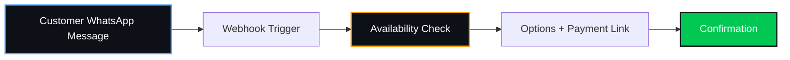

  

---

> **Quick answer:** Travel Agency Website Design Bihar Sharif: WhatsApp Webhooks Ab Aapka Naya Call Center Hain

Ek travel agency owner. Teen log staff me. Phone ek second ke liye shaant nahi hota.

"Patna ki bus kab hai?" "Kiraya?" "Seat bachi hai?" "Cab kitne ki hai Gaya tak?"

Wahi 5 sawal. Din me 100 baar.

Main travel agency website design pe kaam karta hoon, aur ye pattern har agency me dikhta hai. Frustrating hai. Kyunki staff mehnat kar raha hai, par mehnat repeat sawal me jaa rahi hai, booking me nahi.

## 🤖 Pehle Samjho: Webhook Kya Hai

Simple. Customer WhatsApp pe message bhejta hai. WhatsApp tumhare server ko turant ek signal bhejta hai. Wo signal webhook hai. Server booking check karta hai, jawab banata hai, customer ko wapas bhej deta hai.

Insaan ki zaroorat nahi. Beech me koi call nahi.

| Step | Kaun karta hai | Time |
|:--|:--|:--|
| Customer: "Patna, kal subah, 2 seat" | Customer | 5 sec |
| Message server tak pahunchta hai (webhook) | WhatsApp | 1 sec |
| Seat/cab availability check | Server | 1-2 sec |
| Options + payment link customer ko | Server | 1 sec |
| Confirmation + ticket details | Server | 1 sec |

Call center me yehi kaam 3-4 minute leta hai, aur staff ke mood pe depend karta hai.

## 💸 Unit Economics: Call Center vs Webhook

| Item | Manual (phone) | WhatsApp automation | Why this number |
|:--|:--|:--|:--|
| Roz ki calls/queries | 100 | 100 | Typical busy local agency query volume. |
| Time per query | 3 min | ~0 (auto) | Average manual call time vs automated. |
| Total staff time | 300 min = 5 ghante/din | Sirf complex cases | Calculated from volume (100 * 3 min). |
| Staff cost (1 extra banda) | ₹10,000/mahina | ₹0 extra | Average salary for a booking clerk in Tier-2. |
| Missed call se chhoota booking | 10/mahina | Near zero, bot 24x7 hai | Estimated loss due to busy lines at peak times. |
| Margin per booking | ₹300 | ₹300 | Average net profit per seat/ticket sold. |

Sirf missed bookings ka hisaab: 10 x ₹300 = ₹3,000/mahina. Staff ka bachat: ₹10,000/mahina. Total fayda ₹13,000/mahina, yaani ₹1,56,000/saal.

> **Research note:** These figures are directional estimates based on publicly available patterns for Tier-2 Indian travel agencies. Actual numbers vary by city, season, fleet size, and routes served. Replace every input with your own real numbers before drawing conclusions.

Ye line kisi ke P&L me nahi dikhti. Jo customer ne line busy dekh ke dusri agency ko call kiya, uska hisaab kaun rakhta hai.

## 📉 Problem Kya Hai? Single Thread, Zero Queue

Phone call me ek time pe ek hi insaan se baat ho sakti hai. Engineer ki bhasha me: single thread, no queue. Peak time pe (tyohar, shaadi, chhath) 10 log ek saath call karte hain, 9 ko busy tone milta hai. Ye design nahi, ye bottleneck hai.

WhatsApp webhook concurrent hai. 50 message ek saath aaye, 50 ko jawab milega. Server load ka fark yahi hai.

## 🏗️ Kya Banana Hai

- **WhatsApp booking flow:** Route, date, seats. Bot sab pooche aur confirm kare
- **Auto ticket confirmation:** Details, pickup point, driver ya bus ka number
- **Payment link:** UPI se advance, no-show kam
- **Reminder:** Safar se pehle auto-message
- **Website + portal:** Rate chart, routes, booking button, fleet photos
- **Local SEO:** Google Business Profile, "cab booking Bihar Sharif", schema, reviews
- **Dashboard:** Kaun si route chal rahi hai, kaun si nahi
- **Human handoff:** Complex query pe staff ko transfer. Bot sab nahi karta

## 🔍 Bihar Sharif Me Customer Kya Search Karta Hai

Developer "travel agency website design" search karta hai. Customer nahi.

Customer type karta hai: "Bihar Sharif to Patna bus", "cab booking Biharsharif", "Gaya taxi service", "बिहारशरीफ से पटना टैक्सी".

| Search term | Intent |
|:--|:--|
| Bihar Sharif to Patna bus | Ready to travel / Timetable search |
| cab booking Biharsharif | High intent / Direct booking |
| Gaya taxi service | Outstation inquiry |
| बिहारशरीफ से पटना टैक्सी | Hindi local search |

Jo ki sach me Biharsharif ke users search karte hain apne phone se isiliye tumhe search terms ko identify karna hoga. Wahi spelling, wahi route ke naam, wahi bolchaal. Galat keyword pe traffic bhejoge to resource waste.

---

## ⏳ Jo Agency Pehle Automate Karegi, Wahi Customer Rakhegi

- Customer ko jawab 10 second me mila to wo wahin book karta hai. Jo agency 10 minute baad call back karti hai, customer usse pehle book kar chuka hota hai.
- Tyohar aur shaadi ke season me booking ek hi baar aati hai. Is season ka customer agle season nahi milega.
- Google Map pe top 3 me 3 hi jagah hain. Jo agency pehle optimize karegi, uske reviews aur ranking pehle ban jayenge.

---

## 🛠️ The Booking Journey: Customer to Confirmation

---

## 📈 ROI

Setup ek baar ka kharcha, WhatsApp ka monthly usage alag. Ek standard WhatsApp integrated website ka setup cost lagbhag ₹15,000 se ₹25,000 tak hota hai, jisme WhatsApp Business API ka base setup shamil hota hai. Agar staff aur missed booking ka fayda ₹13,000/mahina bhi aaya (jaisa humne calculation me dekha), to payback 1 se 2 mahine me hi ho jata hai.

---

## ✅ Checklist: Signals of an Agency Losing Bookings

- [ ] Call flow peak hours me manage nahi hota, bohot calls drop hoti hain.
- [ ] Customers ko WhatsApp par manual reply karne me 10+ minute lag jate hain.
- [ ] Rate chart aur timetable manually bar-bar bhejna padta hai.
- [ ] No-show aur last-minute cancellations zyaada hote hain kyunki advance payment track nahi hoti.
- [ ] Google pe local travel queries par agency ki website nahi milti.

> **Agar aapne 2 se zyada tick kiye hain, to aap bookings gawa rahe hain.**

---

## 💳 Standard Pricing & ROI

This pricing applies to all VYOMARC website projects regardless of industry. The ROI below uses this post's own unit economics.

| Item | Value |
|:--|:--|
| Development charge | **₹9,999 – ₹24,999 (one time)** |
| Domain (.in / .com) | **At actuals** |
| Annual support and cloud fee | **₹4,999 per year** |
| What we deliver | **Hosting + 2 changes every month** |
| SSL security (worth ₹1,000) | **Free** |
| Setup charge: ₹1,200 | **Free** |

| Line | Calculation | Result |
|:--|:--|:--|
| Monthly saving / recovered revenue | (from unit economics) | ₹13,000 |
| One-time development charge (mid-point) | (₹9,999 + ₹24,999) ÷ 2 | ₹17,499 |
| Annual support & cloud fee | flat | ₹4,999 |
| First-year net gain | (12 × monthly saving) − one-time − annual fee | ₹133,502 |
| Payback period | one-time ÷ monthly saving | 1.3 months |

> **Research note:** Support fees, usage costs, and third-party charges (like WhatsApp Business API, payment gateway fees, or domain costs) are separate and vary by usage — not included in the flat development charge.

## ❓ FAQ

**Travel agency website banwane ka kharcha kitna aata hai?**
Scope pe depend karta hai: pages, booking flow, WhatsApp automation, local SEO. Audit ke baad fixed quote. Price range: ₹9,999 to ₹19,999.

**Kya WhatsApp automation ke liye alag app chahiye?**
Nahi. Customer ko apna normal WhatsApp hi use karna hai. Koi nayi app download karne ki zaroorat nahi hoti.

**Kya mere bus/cab ki seat availability sync ho sakti hai?**
Apni fleet ho to haan. Dusre operators ki seat inventory unke system ya API pe depend karti hai.

**Kitna time lagta hai?**
Typically 7 to 14 working days, scope ke hisaab se.

---

---

## 📍 Areas We Serve

VYOMARC Technologies serves ambitious local businesses across **Bihar Sharif, Patna, Gaya, Muzaffarpur, Bhagalpur, Nalanda, and Rajgir**.

* **Bihar Sharif & Nalanda**: Core local SEO, hospital booking systems, and top coaching institute digital infrastructure.
* **Patna**: High-performance corporate websites and digital marketing for scaling enterprises.
* **Gaya & Rajgir**: Travel agency booking systems and premium real estate web design.
* **Muzaffarpur & Bhagalpur**: Zero-commission e-commerce and local retail WhatsApp automation.

## 🏢 About VYOMARC Technologies

**VYOMARC Technologies** is a premium software engineering company and website developer located in Ramchandarpur, Biharsharif, Nalanda, Bihar, 803216. We specialize in building secure NTA-grade CBT platforms, local SEO, and zero-commission WhatsApp ordering systems to help local businesses scale without technical overhead. Proudly serving Bihar Sharif, Patna, Gaya, Muzaffarpur, Bhagalpur, Nalanda, and Rajgir. 
**Contact**: vyomarctechnologies@gmail.com | **WhatsApp/Call**: +91 825 270 2699 | **Hours**: Mon–Sat, 10:00 AM to 4:00 AM.

## 🚀 Next Step

Kal ek din ginti karo: kitni calls aayi, kitni miss hui, kitni same sawal ki thi. Wo number tumhara asli nuksaan hai.

Hum VYOMARC Technologies, Bihar Sharif me yahi karte hain. Audit, phir build, phir har hafte ka booking report.

Contact karein Whatsapp par!
